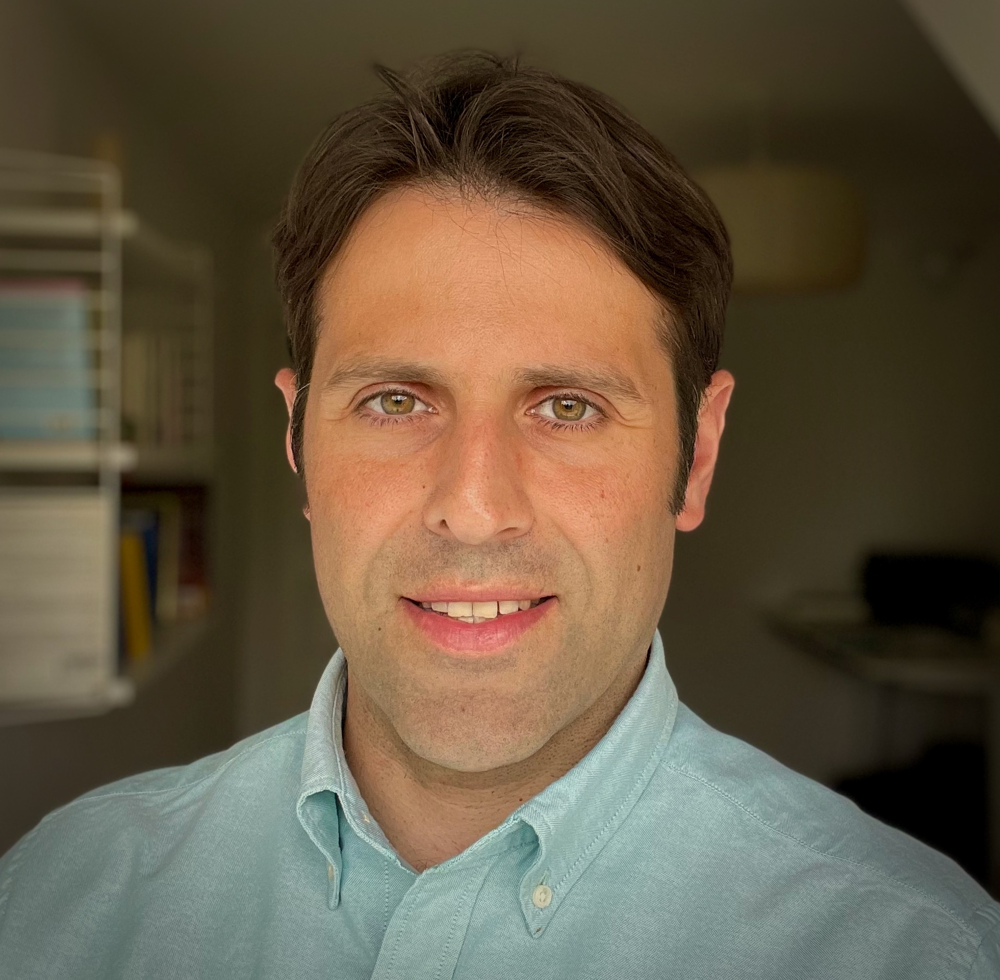

    <h3 itemprop="name">Rami Mochaourab</h3>
    

    <i>Postdoctoral Fellow</i>
    

    

    Department of Automatic Control 
    Department of Information Science and Engineering 
    KTH Royal Institute of Technology
    

    

    ramimo@kth.se
    

    <!--
<a href="cv_rami_mochaourab.pdf">Curriculum Vitae</a>
-->
    

    <a href="http://scholar.google.com/citations?user=o3R2mZ4AAAAJ">Google Scholar Profile</a>
    

<h3 itemprop="name">Rami Mochaourab</h3>
<i>Postdoctoral Fellow</i>

Department of Automatic Control 
Department of Information Science and Engineering 
KTH Royal Institute of Technology

ramimo@kth.se
&emsp;&emsp;
<a itemprop="url" href="http://scholar.google.com/citations?user=o3R2mZ4AAAAJ">Google Scholar Profile</a>

<a target="_self" href="index.html">Home</a>&emsp;&emsp;
<a target="_self" href="publications.html">Publications</a>&emsp;&emsp;
<a target="_self" href="awards.html">Awards</a>&emsp;&emsp;
<a target="_self" href="reviewer.html">Reviewer</a>

I am postdoctoral researcher working with Prof. Alexandre Proutiere and Assoc. Prof. Tobias Oechtering. My research interests are in privacy-preserving mechanisms, machine learning, and signal processing.

[//]: # (Prior to my current position, I was with the Signal Processing Department and ACCESS Linnaeus Centre at KTH Royal Institute of Technology as a postdoctoral fellow from May 2014 until November 2016. From August 2012 until February 2014, I was a researcher at Fraunhofer Heinrich-Hertz-Institut Berlin in the Wireless Communications and Networks Department.()

### Previous Positions

* Postdoctoral researcher with Signal Processing Department and ACCESS Linnaeus Centre at KTH Royal Institute of Technology from May 2014 until November 2016
* Researcher at Fraunhofer Heinrich-Hertz-Institut Berlin in the Wireless Communications and Networks Department from August 2012 until February 2014

### Education
* Ph.D. in Electrical Engineering, TU-Dresden, May 2012 <code>[[Ph.D. Thesis]](http://www.qucosa.de/fileadmin/data/qucosa/documents/9011/Thesis_Mochaourab_2012.pdf)</code>
* M.Sc. in Information Systems Engineering, TU-Dresden, January 2008 <code>[[Masters Thesis]](papers/RM_Diploma_Thesis.pdf)</code>
